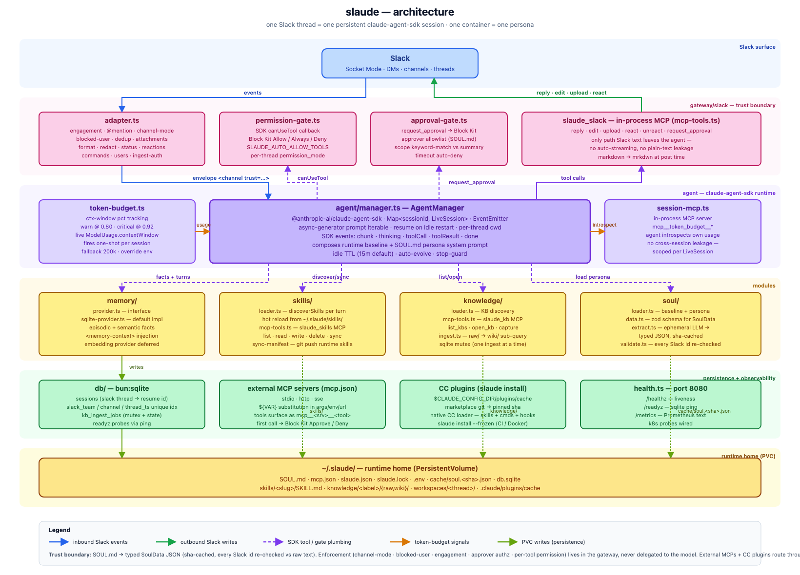

# slaude

[](https://github.com/barockok/slaude/actions/workflows/ci.yml)
[](https://github.com/barockok/slaude/actions/workflows/docker.yml)
[](https://github.com/barockok/slaude/actions/workflows/release.yml)
[](https://codecov.io/gh/barockok/slaude)
[](https://github.com/barockok/slaude/releases/latest)
[](https://bun.sh)

> **Slack-native Claude Code runtime. One Slack thread = one persistent session.**

Onboard an AI teammate into your Slack workspace. Inspired by [hermes-agent](https://github.com/NousResearch/hermes-agent), rebuilt Slack-only on the official [`@anthropic-ai/claude-agent-sdk`](https://github.com/anthropics/claude-agent-sdk). One container = one persona. Every thread remembers.

```bash
git clone https://github.com/barockok/slaude.git && cd slaude
bun install && bun run manifest > manifest.json   # paste into api.slack.com/apps → From manifest
cp .env.example .env && docker compose up -d --build
```

## Documentation

| Section | What you will find | Time |
|---|---|---|
| [**Getting Started**](docs-new/getting-started/index.md) | 5-min quickstart, prerequisites, first DM test | 5 min |
| [**Configuration**](docs-new/configuration.md) | Env vars, Slack tokens, Anthropic auth, `SOUL.md` schema, `slaude.json` | 10 min |
| [**Architecture**](docs-new/architecture.md) | Session lifecycle, trust boundary, gateway ↔ agent ↔ MCP, persistence | 8 min |
| [**Guides**](docs-new/guides/engagement-and-approvals.md) | Engagement, approvals, `/1on1`, slash commands, cron, attachments | — |
| [**API Reference**](docs-new/api/reference.md) | `mcp__slaude_*` tools, Markdown→mrkdwn, external MCP, skills, KB | — |
| [**Deployment**](docs-new/deployment/index.md) | Docker, Kubernetes, health probes, upgrades, backup, troubleshooting | — |
| [**Examples**](docs-new/examples.md) | Runnable: first skill, first ingest, custom MCP, sim without Slack | — |

Full site entry: [**docs-new/index.md**](docs-new/index.md) · Sidebar: [**docs-new/_sidebar.md**](docs-new/_sidebar.md)

## At a glance



<sub>Source: [`docs/architecture.html`](docs/architecture.html) — regenerate PNG via headless Chrome (see file header).</sub>

| Feature | What it means |
|---|---|
| **Thread = Session** | SDK `resume:` keeps history across idle restarts (`SLAUDE_IDLE_MINUTES` default 15). |
| **Two-layer persona** | Hardcoded baseline (output, engagement, approval discipline) + your `SOUL.md` (name, role, mandate, approvers). |
| **MCP-only Slack I/O** | Every reply via `mcp__slaude_slack__reply` / `edit` / `upload` / `request_approval`. Markdown auto-converts to mrkdwn. |
| **Approvals** | Agent runs YOLO, calls `request_approval()` for mutating work. Allowlist parsed from `SOUL.md` — agent never picks IDs. |
| **Engagement** | `@mention` engages thread, mentioning someone else disengages. DMs always engaged. `/1on1` locks thread. |
| **Skills & KB** | `~/.slaude/skills/<slug>/SKILL.md` hot-reloads; `knowledge/` wikis compound via `raw/` → `wiki/` `/ingest`. |
| **Simulation** | `bun run sim` verifies gates with no Slack — same `createGateway`, in-memory transport. |

**Trust boundary:** LLM extracts `SOUL.md` → typed JSON → sha-cached; gateway verifies every Slack ID against raw text before any gate. Enforcement lives in gateway, never model. See [Architecture](docs-new/architecture.md#trust-boundary).

## Quickstart

```bash
# 1. Slack app from manifest
bun run manifest > manifest.json
# → api.slack.com/apps → Create New App → From manifest → paste
# → App-Level Tokens → connections:write (xapp-…) → Install to workspace (xoxb-…)

# 2. Env
cp .env.example .env   # fill SLACK_BOT_TOKEN, SLACK_APP_TOKEN, ANTHROPIC_API_KEY or CLAUDE_CODE_OAUTH_TOKEN

# 3. Run
bun run dev            # local — or —
docker compose up -d --build
curl localhost:8080/healthz   # {"status":"ok"}
```

Next: [Getting Started](docs-new/getting-started/index.md) → [Configuration](docs-new/configuration.md) → [Deployment](docs-new/deployment/index.md)

## Project

- **Releases:** [`docs/releases/`](docs/releases/) — hand-written notes per tag (Features / Fixes / Docs)
- **Findings:** [`docs/findings/`](docs/findings/) — decisions & incident lore
- **Contributing:** [`CONTRIBUTING.md`](CONTRIBUTING.md) · **Security:** [`SECURITY.md`](SECURITY.md) · **License:** MIT

---

<sub>slaude v0.41.0 · [GitHub](https://github.com/barockok/slaude) · Built with Bun + TypeScript + claude-agent-sdk</sub>
