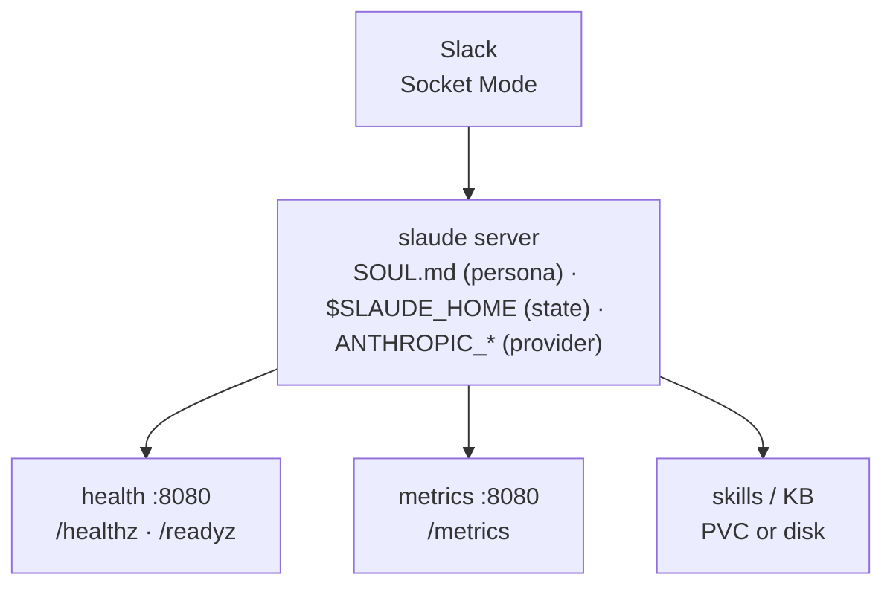

# Deployment & Operations

Deploy slaude the way you deploy any long-lived bot: one persona per deploy, persistent state on a volume, health probes on `:8080`, and zero-downtime upgrades via symlink swap.



> **One deploy = one persona = one `SOUL.md`.** Multi-agent means multi-deploy — each agent gets its own `SOUL.md`, its own volume, and its own Slack identity. See [Multi-agent](#multi-agent-via-multi-deploy) below.

---

## Prerequisites

| Requirement | Notes |
|---|---|
| Slack app | Socket Mode enabled, `xapp-` app token + `xoxb-` bot token |
| LLM provider | Anthropic API key **or** Claude Pro/Max OAuth token (`claude setup-token`), or any Anthropic-compatible gateway |
| Runtime | Docker + Compose, or Kubernetes, or Bun ≥ 1.3 for bare metal |
| Persistent storage | 1 GiB+ for `$SLAUDE_HOME` (SQLite + workspaces + skills + KB) |

---

## Environment

Copy `.env.example` to `.env` — every variable is documented there.

```bash
cp .env.example .env
# then fill SLACK_*, ANTHROPIC_*, SLAUDE_MODEL
```

### Core variables

| Variable | Required | Default | Description |
|---|---|---|---|
| `SLACK_BOT_TOKEN` | Yes | — | `xoxb-` bot token |
| `SLACK_APP_TOKEN` | Yes | — | `xapp-` Socket Mode token |
| `SLACK_USER_TOKEN` | No | — | `xoxp-` user token for presence / post-as-user |
| `SLACK_POST_AS_USER` | No | `false` | Post as the real Slack user (requires `SLACK_USER_TOKEN`) |
| `ANTHROPIC_API_KEY` | One of `API_KEY` / `OAUTH_TOKEN` | — | Anthropic API key (also works with compatible gateways) |
| `CLAUDE_CODE_OAUTH_TOKEN` | One of `API_KEY` / `OAUTH_TOKEN` | — | Claude Pro/Max OAuth token from `claude setup-token` |
| `ANTHROPIC_BASE_URL` | No | `https://api.anthropic.com` | Override for OpenRouter, Z.ai, self-hosted gateways |
| `ANTHROPIC_AUTH_TOKEN` | No | — | Bearer token for gateways that prefer it over `x-api-key` |
| `SLAUDE_MODEL` | Conditional | `claude-sonnet-4-6` | Provider-qualified model id. **Required** when `ANTHROPIC_BASE_URL` points at a non-Anthropic gateway |
| `SLAUDE_HOME` | No | `~/.slaude` (bare metal) / `/data` (container) | Home dir — SOUL.md, skills, KB, db, workspaces |
| `SLAUDE_HEALTH_PORT` | No | `8080` | Health server port. `0` disables |
| `SLAUDE_IDLE_MINUTES` | No | `15` | Per-thread idle TTL; `0` disables |
| `SLAUDE_DEFAULT_MODE` | No | `ask` | Permission mode: `ask` / `accept-edits` / `bypass` / `plan` / `dont-ask` |
| `SLAUDE_AUTO_ALLOW_TOOLS` | No | `Read,Grep,Glob,LS` | Comma-separated tools auto-allowed without approval gate |
| `SLAUDE_APPROVERS` | No | — | Fallback approver allowlist when `SOUL.md` has no `## Approvers` |
| `SLAUDE_METRICS_LABELS` | No | — | Static Prometheus labels, e.g. `agent=hermes,env=prod` |
| `ANTHROPIC_MODEL` | No | — | CLI-native fallback when `SLAUDE_MODEL` is unset |
| `ANTHROPIC_SMALL_FAST_MODEL` | No | — | Haiku-class model for compaction / sub-tasks |

> **Warning:** When `ANTHROPIC_BASE_URL` points at a non-Anthropic gateway you **must** set `SLAUDE_MODEL` to a provider-qualified id — those endpoints do not recognise Anthropic's default model id.

### Provider-agnostic endpoints

Slaude speaks the Anthropic Messages API. Any compatible gateway works:

```bash
# OpenRouter
ANTHROPIC_BASE_URL=https://openrouter.ai/api/v1
ANTHROPIC_API_KEY=sk-or-...
SLAUDE_MODEL=anthropic/claude-sonnet-4

# Z.ai
ANTHROPIC_BASE_URL=https://api.z.ai/api/anthropic
ANTHROPIC_API_KEY=...
SLAUDE_MODEL=claude-sonnet-4-20250514

# Self-hosted gateway
ANTHROPIC_BASE_URL=https://llm.internal.example.com
ANTHROPIC_AUTH_TOKEN=...
SLAUDE_MODEL=claude-sonnet-4
```

Telemetry is automatically disabled when `ANTHROPIC_BASE_URL` points at a non-Anthropic host — no Anthropic telemetry headers are sent to third-party gateways.

### `$SLAUDE_HOME` resolution

`$SLAUDE_HOME` is where credentials are intentionally **not** stored — only persona and state that belongs on a volume:

```
$SLAUDE_HOME/
  SOUL.md            # persona — operator-authored, required
  .env               # optional dotenv (loaded before process env)
  .mcp.json          # external MCP servers (supports ${VAR} substitution)
  slaude.json        # dependency manifest (skills / KB)
  slaude.lock        # pinned SHAs
  db.sqlite (+ -wal/-shm)   # sessions, cron, ignores, locks
  workspaces/        # per-thread cwd
  skills/            # installed skills
  knowledge/         # installed KB wikis
  cache/             # extracted SoulData + policy embeddings
  .claude/           # Claude Code config + OAuth creds (file-based on Linux)
```

Resolution order in `bin/slaude.ts` / `src/config/home.ts`:

1. Explicit `$SLAUDE_HOME` wins.
2. If the current directory contains `SOUL.md`, the cwd becomes home (`cd my-agent && slaude` works).
3. Otherwise `~/.slaude`.

Two overrides for split-volume mounts:

| Variable | Default | Purpose |
|---|---|---|
| `SLAUDE_DB_PATH` | `$SLAUDE_HOME/db.sqlite` | Move the DB to a separately-mounted volume when `$SLAUDE_HOME` is read-only |
| `SLAUDE_WORKSPACES` | `$SLAUDE_HOME/workspaces` | Move workspaces likewise |

---

## Docker Compose (recommended)

### 1. Prepare host files

```bash
git clone https://github.com/barockok/slaude.git && cd slaude
cp .env.example .env          # fill SLACK_* + ANTHROPIC_*
mkdir -p data                 # will be mounted as /data = $SLAUDE_HOME
cat > data/SOUL.md <<'MD'
# Soul

I am slaude — your team mate.

## Mandate
...

## Manager
@zidni — Slack user ID U...

## Approvers
- U... (manager)
MD
```

`docker-compose.yaml` mounts `./data:/data` and sets `SLAUDE_HOME=/data`. The container reads secrets from env (or `/data/.env`) and the persona from `/data/SOUL.md`. External MCP servers are declared in `/data/.mcp.json` with `${VAR}` substitution — e.g. `GRAFANA_URL` / `GRAFANA_API_KEY` flow through from `.env` automatically.

```yaml
# docker-compose.yaml (abridged — see repo for full file)
services:
  slaude:
    build: .
    image: slaude:latest
    container_name: slaude
    restart: unless-stopped
    environment:
      SLAUDE_HOME: /data
      SLACK_BOT_TOKEN: ${SLACK_BOT_TOKEN}
      SLACK_APP_TOKEN: ${SLACK_APP_TOKEN}
      ANTHROPIC_API_KEY: ${ANTHROPIC_API_KEY:-}
      ANTHROPIC_BASE_URL: ${ANTHROPIC_BASE_URL:-}
      SLAUDE_MODEL: ${SLAUDE_MODEL:-claude-sonnet-4-6}
      GRAFANA_URL: ${GRAFANA_URL:-}
      GRAFANA_API_KEY: ${GRAFANA_API_KEY:-}
    volumes:
      - ./data:/data
```

### 2. Build and start

```bash
docker compose build
docker compose up -d
docker compose logs -f slaude
```

You should see:

```
[slaude] health server on :8080
[slaude] slack socket mode started
```

### 3. Verify health

```bash
curl -s http://localhost:8080/healthz | jq .
# {"status":"ok","uptime_ms":12345,"sessions_live":0}

curl -s http://localhost:8080/readyz | jq .
# {"status":"ready"}   — 503 {"status":"unready","error":"..."} if DB unreachable

curl -s http://localhost:8080/metrics | head -20
# # HELP slaude_sessions_live Number of live SDK sessions in this process.
# # TYPE slaude_sessions_live gauge
# slaude_sessions_live 0
```

> **Note:** The Dockerfile is multi-stage (`oven/bun:1.3-debian`): `deps` installs prod deps, `builder` runs `bun run install-deps` to bake skills/knowledge artifacts, and the final stage copies those artifacts to `/data/.slaude/*` so a fresh PVC is pre-seeded even when the host `./data` is empty. Operator-authored files (`SOUL.md`, `.mcp.json`, `slaude.json`) are always sourced from the PVC at runtime.

### Updating the Compose deploy

```bash
git pull
docker compose build
docker compose up -d          # recreates container, volume preserved
```

No data loss — `db.sqlite`, workspaces, and installed skills live on the `./data` volume.

---

## Kubernetes

`deploy/k8s/slaude.yaml` is a complete single-persona deploy: Namespace, Secret, ConfigMap, PVC, and Deployment. One Deployment = one persona.

### Apply

```bash
# Edit the Secret + ConfigMap first
vim deploy/k8s/slaude.yaml
#  - Secret/slaude-secrets:  replace REPLACE_xoxb / REPLACE_xapp / REPLACE_sk-ant
#  - ConfigMap/slaude-config: paste the persona SOUL.md under SOUL.md: |
#  - Deployment: set image: ghcr.io/<owner>/slaude:<tag>

kubectl apply -f deploy/k8s/slaude.yaml
kubectl -n slaude rollout status deploy/slaude
kubectl -n slaude logs -f deploy/slaude
```

### What the manifest creates

| Resource | Name | Purpose |
|---|---|---|
| `Namespace` | `slaude` | Isolation |
| `Secret` | `slaude-secrets` | `SLACK_BOT_TOKEN`, `SLACK_APP_TOKEN`, `ANTHROPIC_API_KEY` (+ optional `ANTHROPIC_BASE_URL` / `ANTHROPIC_AUTH_TOKEN`) |
| `ConfigMap` | `slaude-config` | `SLAUDE_MODEL`, `SLACK_ALLOWED_USERS`, and `SOUL.md` (mounted at `/data/SOUL.md` via `subPath`) |
| `PersistentVolumeClaim` | `slaude-data` | `1Gi`, `ReadWriteOnce` — SQLite + workspaces + skills + KB |
| `Deployment` | `slaude` | `replicas: 1`, `strategy: Recreate`, probes on `:8080` |

### Probes

```yaml
livenessProbe:
  httpGet: { path: /healthz, port: health }   # :8080 — always 200 when process is up
  initialDelaySeconds: 10
  periodSeconds: 30
readinessProbe:
  httpGet: { path: /readyz, port: health }    # :8080 — 200 only if DB reachable (SELECT 1)
  initialDelaySeconds: 5
  periodSeconds: 10
```

`Recreate` (not `RollingUpdate`) is intentional — Slack Socket Mode is single-leader; two replicas would both consume events and duplicate responses.

### Resources

```yaml
resources:
  requests: { cpu: "100m", memory: "256Mi" }
  limits:   { cpu: "1000m", memory: "1Gi" }
```

Bump `memory` limits for large-context models or heavy skill installs.

### Multi-agent via multi-deploy

Each persona is a separate Deployment + PVC + Secret + ConfigMap. Duplicate the manifest per persona — only the names, labels, and `SOUL.md` change:

```bash
# persona: hermes — customer-facing agent
kubectl apply -f deploy/k8s/slaude-hermes.yaml   # namespace: slaude-hermes
# persona: maria — internal agent
kubectl apply -f deploy/k8s/slaude-maria.yaml    # namespace: slaude-maria
```

Label each Deployment with `persona: <name>` so dashboards and `SLAUDE_METRICS_LABELS` can differentiate:

```yaml
metadata:
  labels: { app: slaude, persona: hermes }
spec:
  template:
    metadata:
      labels: { app: slaude, persona: hermes }
```

Alternatively, keep one namespace and suffix resource names (`slaude-hermes`, `slaude-maria`).

> **Warning:** Never scale a single slaude Deployment beyond `replicas: 1`. For more agents, add more Deployments — not more replicas.

### Updating a K8s deploy

```bash
# Option A — update image tag in place
kubectl -n slaude set image deploy/slaude slaude=ghcr.io/<owner>/slaude:v0.42.0
kubectl -n slaude rollout status deploy/slaude

# Option B — re-apply the manifest after editing SOUL.md / ConfigMap
kubectl apply -f deploy/k8s/slaude.yaml
kubectl -n slaude rollout restart deploy/slaude
```

SQLite migrations run automatically on boot — the `db/schema.ts` migrates in place (WAL mode, additive columns, table rebuilds inside transactions).

---

## Horizontal scale (gateway + nodes)

Everything above deploys slaude as **one process per persona**. For many
personas / many concurrent threads, the horizontal-scale topology splits it
into stateless **gateway** replicas (Slack Events API ingress, `/v1` control
plane) and a pool of **node** workers (BullMQ consumers running the SDK
turns) over Postgres, Redis, and a shared RWX volume. Roles are selected by
`SLAUDE_ROLE=mono|gateway|node` — `mono` (the default) is the single-process
behavior documented on this page, unchanged.

- **[Multi-Node Deployment](multi-node.md)** — topology, local dev loop,
  `docker-compose.scale.yaml` (gateway + 2 nodes), CI surface.
- **[Scale Operations](scale-operations.md)** — the full metric surface,
  what to alert on, sample PromQL, scaling/draining behavior.
- **`deploy/k8s-scale/`** — Kubernetes manifests: gateway + node Deployments,
  Service/Ingress, RWX PVC, Secrets template (kubeseal example), KEDA
  queue-depth autoscaling with a CPU-HPA fallback. See its README for
  prerequisites (managed Postgres/Redis, RWX StorageClass, KEDA).
- Slack ingress runs in **http mode** (`SLAUDE_SLACK_MODE=http`, Events API)
  with per-workspace apps in the encrypted `slack_apps` registry; installs
  arrive via `bun run slack-app add` or the OAuth flow (`/slack/oauth/start`,
  enabled by `SLACK_CLIENT_ID`).
- Architecture and invariants: `docs/internal/superpowers/specs/2026-08-24-horizontal-scale-design.md`.

> The single-Deployment warning above does not apply to this topology:
> gateway and node Deployments are built to scale by replica count.

---

## Health & Metrics

The health server is Bun's native `Bun.serve()` — no extra dependency, no sidecar.

| Endpoint | Status | Body | Use |
|---|---|---|---|
| `GET /healthz` | `200` always (when process is up) | `{"status":"ok","uptime_ms":12345,"sessions_live":2}` | Liveness probe |
| `GET /readyz` | `200` if `SELECT 1` succeeds, `503` otherwise | `{"status":"ready"}` or `{"status":"unready","error":"..."}` | Readiness probe |
| `GET /metrics` | `200` | Prometheus text format `v0.0.4` | Scrape target |

Configure via env:

```bash
SLAUDE_HEALTH_PORT=8080   # default; 0 disables the server entirely
```

### Prometheus metrics

Metrics are hand-rendered — no `prom-client` dependency. Static labels from `SLAUDE_METRICS_LABELS` are appended to every series.

| Metric | Type | Labels | Description |
|---|---|---|---|
| `slaude_sessions_live` | gauge | — | Live SDK sessions in this process |
| `slaude_turns_total` | counter | `result` | Completed turns |
| `slaude_tool_calls_total` | counter | `tool` | Tool invocations by tool name |
| `slaude_tokens_total` | counter | `kind`, `channel_id`, `model` | Tokens consumed |
| `slaude_context_window_pct` | gauge | — | Most recent context-window usage (0..1) |
| `slaude_stop_guard_blocked_total` | counter | — | Times the Stop hook blocked an early exit |
| `slaude_stop_guard_failed_total` | counter | — | Times the Stop hook blocked but the agent still stopped |
| `slaude_errors_total` | counter | `kind` | Errors raised during a turn |
| `slaude_slack_drops_total` | counter | `reason` | Inbound Slack events dropped before processing |
| `slaude_disengaged_suppressed_total` | counter | — | Messages suppressed by the disengaged hook |
| `slaude_user_turns_total` | counter | `user_id`, `user_name` | Inbound user turns (opt-in via `SLAUDE_METRICS_PER_USER=1`) |

The gateway/node topology adds queue, registry, and per-node metrics (histograms included) — see [Scale Operations](scale-operations.md) for that full surface and alerting guidance.

Example scrape:

```yaml
# prometheus.yml
scrape_configs:
  - job_name: slaude
    static_configs:
      - targets: ["slaude:8080"]
```

Add static labels per deploy for multi-agent cost attribution:

```bash
SLAUDE_METRICS_LABELS="agent=hermes,env=prod"
SLAUDE_METRICS_PER_USER=1   # opt-in: emit user_id/user_name on slaude_user_turns_total
```

---

## Bare Metal / Binary Install

For long-lived VPS or laptop deploys without Docker.

### Automatic install (curl | bash)

```bash
curl -fsSL https://raw.githubusercontent.com/barockok/slaude/main/install.sh | bash
# Env overrides:
#   SLAUDE_VERSION=x.y.z    pin a release (without v prefix)
#   SLAUDE_DIST=~/.slaude-dist
#   SLAUDE_BIN_DIR=~/.local/bin
#   SLAUDE_NO_BOOTSTRAP=1   skip bun/uv auto-install

# Ensure ~/.local/bin is on PATH
export PATH="$HOME/.local/bin:$PATH"
```

What `install.sh` does:

1. Detects `Linux`/`Darwin` + `x86_64`/`arm64`; installs `bun` + `uv` if missing.
2. Resolves the latest release tag via `GET /repos/barockok/slaude/releases/latest` (or uses `$SLAUDE_VERSION`).
3. Downloads `slaude-<version>.tar.gz` + `sha256sums.txt` and verifies the checksum (aborts on mismatch).
4. Extracts to `$SLAUDE_DIST/<version>`, runs `bun install --frozen-lockfile`.
5. Atomically swaps `$SLAUDE_DIST/current` → `<version>` and symlinks `~/.local/bin/slaude` → `$SLAUDE_DIST/current/bin/slaude.ts`.

### Manual link (from a clone)

```bash
git clone https://github.com/barockok/slaude.git && cd slaude
bun install
bun run link
# links bin/slaude.ts → ~/.bun/bin/slaude (ensure ~/.bun/bin is on PATH)
```

### Running

```bash
# $SLAUDE_HOME resolves to: $SLAUDE_HOME > ./SOUL.md dir > ~/.slaude
slaude start              # boot the Slack runtime (or bare `slaude`)
slaude sim                # local sim REPL (Slack-free verification)
slaude brain-server       # standalone brain MCP server
slaude brain connect      # OAuth-bootstrap a remote brain link

# Self-management (built into bin/slaude.ts)
slaude version            # prints active vs latest: "slaude 0.41.0 (latest: 0.41.0)"
slaude update             # fetch latest, verify checksum, swap current, prune old
slaude rollback           # swap back to previous version
slaude --help             # usage
```

`slaude update` / `rollback` operate on the `$SLAUDE_DIST` layout — the `current` symlink is swapped atomically (`ln -sfn + mv -T` on Linux, `ln -sfn` fallback on macOS). Previous versions are kept (last 3) and pruned automatically.

---

## Upgrades

### Docker

```bash
git pull
docker compose build
docker compose up -d
docker compose logs -f slaude | grep -E "health server|slack socket|ready"
```

### Kubernetes

```bash
kubectl -n slaude set image deploy/slaude slaude=ghcr.io/<owner>/slaude:v0.42.0
kubectl -n slaude rollout status deploy/slaude
# or re-apply the manifest after editing SOUL.md
kubectl apply -f deploy/k8s/slaude.yaml
kubectl -n slaude rollout restart deploy/slaude
```

### Binary

```bash
slaude update             # latest stable
SLAUDE_VERSION=0.42.0 slaude update   # pinned
slaude version            # verify
# if broken:
slaude rollback
```

### Release candidates

Changes touching `install.sh`, the `~/.slaude-dist` layout, the DB schema, or the agent loop ship as `vX.Y.Z-rc.N` pre-releases first. They never resolve as `latest`:

```bash
SLAUDE_VERSION=0.42.0-rc.1 bash install.sh   # explicit RC install
# soak, then maintainer promotes:
scripts/promote-rc.sh v0.42.0-rc.1           # bumps to v0.42.0 stable
```

Notes for each release live in `docs/site/_content/releases/vX.Y.Z.md` from the first RC onward.

---

## Logs

| Deploy | Command |
|---|---|
| Docker Compose | `docker compose logs -f slaude` |
| Kubernetes | `kubectl -n slaude logs -f deploy/slaude` |
| Bare metal | stdout/stderr of `slaude start` (systemd: `journalctl -u slaude -f`) |
| Previous container | `docker compose logs --tail 200 slaude` / `kubectl logs --previous` |

Key log lines to expect on healthy boot:

```
[slaude] health server on :8080
[persona] multi-persona mode: hermes, maria   # only in multi-persona mode
[slaude] slack socket mode started
```

If you see `health server disabled`, `SLAUDE_HEALTH_PORT` is `0` or invalid — probes will fail.

---

## Backup & Restore

### What to back up

Everything that matters lives under `$SLAUDE_HOME` on the volume:

| Path | What it holds | Backup priority |
|---|---|---|
| `db.sqlite` + `db.sqlite-wal` + `db.sqlite-shm` | Sessions, cron jobs, ignores, 1:1 locks, soul overrides | **Critical** — copy all three together (WAL mode) |
| `SOUL.md` | Persona (also in ConfigMap for K8s) | **Critical** |
| `.mcp.json` | External MCP server config | High |
| `slaude.json` + `slaude.lock` | Dependency manifest + pinned SHAs | High |
| `workspaces/` | Per-thread cwd (agent working dirs) | Medium — reconstructable |
| `skills/` + `knowledge/` | Installed skills + KB wikis | Low — reinstalled via `bun run install-deps` |
| `cache/` | SoulData + policy embeddings | Low — regenerated on boot |

### Docker Compose backup

```bash
# SQLite backup — use the sqlite3 backup API for a consistent snapshot,
# or copy all three files while the container is stopped.
docker compose stop slaude
cp -a data/db.sqlite* /backups/slaude-$(date +%F)/
cp -a data/SOUL.md data/.mcp.json data/slaude.json data/slaude.lock /backups/slaude-$(date +%F)/
docker compose start slaude

# Or hot-backup via sqlite3 (no downtime):
docker compose exec slaude sqlite3 /data/db.sqlite ".backup /data/db-hot.sqlite"
docker cp slaude:/data/db-hot.sqlite ./db-$(date +%F).sqlite
```

### Kubernetes backup

Snapshot the PVC (preferred) or exec-copy:

```bash
# PVC snapshot (requires VolumeSnapshot support)
kubectl apply -f - <<'YAML'
apiVersion: snapshot.storage.k8s.io/v1
kind: VolumeSnapshot
metadata: { name: slaude-data-snap, namespace: slaude }
spec: { source: { persistentVolumeClaimName: slaude-data } }
YAML

# Or copy files out
kubectl -n slaude exec deploy/slaude -- tar -czf - -C /data db.sqlite* SOUL.md .mcp.json slaude.json slaude.lock \
  | tar -xzf - -C ./restore-$(date +%F)/
```

### Restore

```bash
# Docker Compose
docker compose down
cp -a /backups/slaude-2026-08-24/* data/
docker compose up -d

# Kubernetes — restore into a new PVC or copy back via kubectl cp
kubectl -n slaude cp ./restore-2026-08-24/db.sqlite slaude-xxx:/data/db.sqlite
kubectl -n slaude rollout restart deploy/slaude
```

> **Warning:** Never restore `db.sqlite` without its `-wal` / `-shm` companions unless you used `.backup` — a raw `cp db.sqlite` alone can be inconsistent under WAL mode. Stop the container first, or use the SQLite backup API.

---

## Troubleshooting

| Symptom | Cause | Fix |
|---|---|---|
| `missing env SLACK_BOT_TOKEN` on boot | `.env` not loaded or vars not exported | `cp .env.example .env` and fill it; Compose reads `.env` automatically, bare metal reads `$SLAUDE_HOME/.env` |
| `slack socket mode started` never appears | Invalid `SLACK_APP_TOKEN` (`xapp-` required) or missing `connections:write` scope | Reinstall the Slack app with Socket Mode + `connections:write`; verify token prefix `xapp-` |
| Bot does not respond in channels | Engagement gate blocked — only manager / allowed channels engage by default | Add `## Allowed channels` to `SOUL.md` or message in a whitelisted channel / DM the manager |
| `health server disabled` | `SLAUDE_HEALTH_PORT=0` or non-numeric | Set `SLAUDE_HEALTH_PORT=8080` (or unset) |
| `/healthz` returns `200` but `/readyz` returns `503` | SQLite unreachable (PVC not mounted, corrupt DB, `SLAUDE_DB_PATH` misconfigured) | Check volume mount: `docker compose exec slaude ls -lh /data/db.sqlite`; K8s: `kubectl -n slaude exec deploy/slaude -- ls -lh /data/` |
| `no SOUL.md` or empty persona | `SOUL.md` not at `$SLAUDE_HOME/SOUL.md` | Docker: `ls data/SOUL.md`; K8s: `kubectl -n slaude describe configmap slaude-config`; Bare metal: `ls ~/.slaude/SOUL.md` |
| `ANTHROPIC_API_KEY` auth fails on gateway | Wrong `ANTHROPIC_BASE_URL` or missing `SLAUDE_MODEL` | Non-Anthropic gateways require `SLAUDE_MODEL` set to a provider-qualified id |
| `mcp__*` tools always need approval | `SLAUDE_AUTO_ALLOW_TOOLS` too narrow | Add tools to the allowlist: `SLAUDE_AUTO_ALLOW_TOOLS=Read,Grep,Glob,LS,Bash` |
| Cron jobs not firing | Scheduler not started or `cron_jobs` table missing `paused` column on old DB | Restart slaude — migrations add `paused` automatically; check `db.sqlite` exists and is writable |
| OAuth `/mcp connect` callback unreachable (K8s / remote) | Ephemeral loopback not routable from the browser | Set `SLAUDE_OAUTH_REDIRECT_URL=https://slaude.example.com/oauth/paste` (paste-back mode) + host a static page that shows the `code` |
| `checksum verification failed` on `install.sh` | Corrupt download or version mismatch | Re-run without `SLAUDE_VERSION` pin; verify `sha256sums.txt` exists for that tag on GitHub Releases |
| `slaude version` shows `(none)` | No `~/.slaude-dist/current` symlink (first install, or prerelease dir not matching semver) | Re-run `install.sh` or `slaude update` |
| Container `OOMKilled` | `memory` limit too low for model context | Raise `limits.memory` to `1Gi`+ (K8s) or `mem_limit` (Compose) |

### Quick diagnostics

```bash
# Docker
docker compose ps                          # container up?
docker compose logs --tail 50 slaude       # boot errors?
curl -sf http://localhost:8080/healthz    # liveness
curl -sf http://localhost:8080/readyz     # readiness (DB)
curl -sf http://localhost:8080/metrics | grep slaude_errors_total

# Kubernetes
kubectl -n slaude get pods                 # pod Running?
kubectl -n slaude describe pod -l app=slaude   # probe failures, OOMKilled?
kubectl -n slaude logs --tail 50 -l app=slaude
kubectl -n slaude exec deploy/slaude -- ls -lh /data/

# Bare metal
ls -lh ~/.slaude/db.sqlite* ~/.slaude/SOUL.md
cat ~/.slaude/.env | grep -v TOKEN         # verify env without leaking secrets
slaude version
curl -sf http://localhost:8080/healthz
```

---

## Security Checklist

- [ ] `.env` and `data/` are gitignored — never commit `xoxb-` / `xoxp-` / `sk-ant-` values.
- [ ] K8s `Secret` values are base64-encoded and not checked into git — use `kubectl create secret` or sealed-secrets / external-secrets.
- [ ] `SLACK_POST_AS_USER=false` unless you explicitly need post-as-user — enabling it exposes the human account's full read scope (private channels/DMs) to the agent's tool use.
- [ ] Non-Anthropic gateways: verify telemetry headers are not forwarded — slaude disables them automatically for non-Anthropic `ANTHROPIC_BASE_URL`.
- [ ] Rotate `ANTHROPIC_API_KEY` / `CLAUDE_CODE_OAUTH_TOKEN` on operator change — the OAuth token is a bearer credential.
- [ ] `install.sh` verifies `sha256sums.txt` — never bypass with `--no-verify`.

---

## Next Steps

- [Configuration reference](../reference/configuration.md) — full env var and `SOUL.md` schema.
- [Architecture](../guides/) — agent loop, engagement gate, and approval flow internals.
- [Skills and knowledge](../reference/api.md) — extending the agent with skills and KB wikis.
