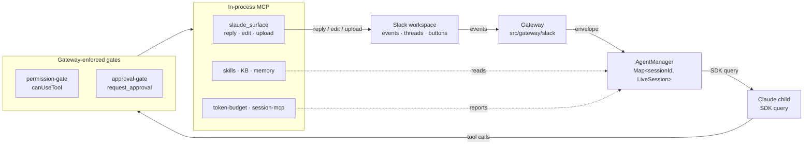
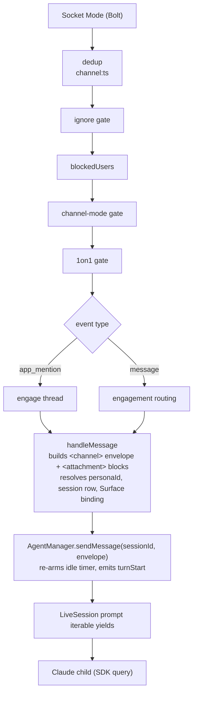
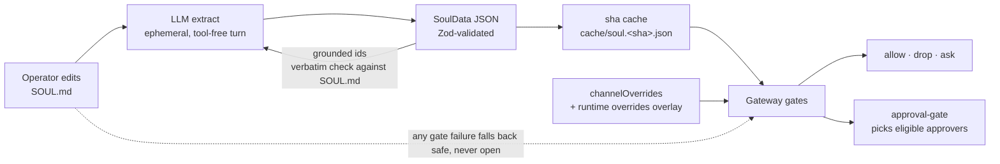
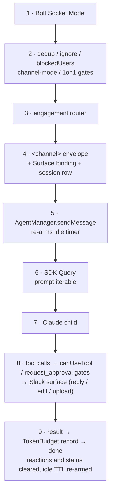
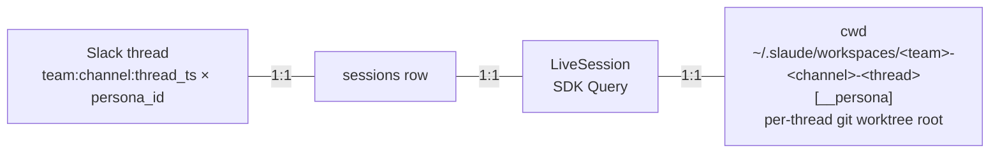
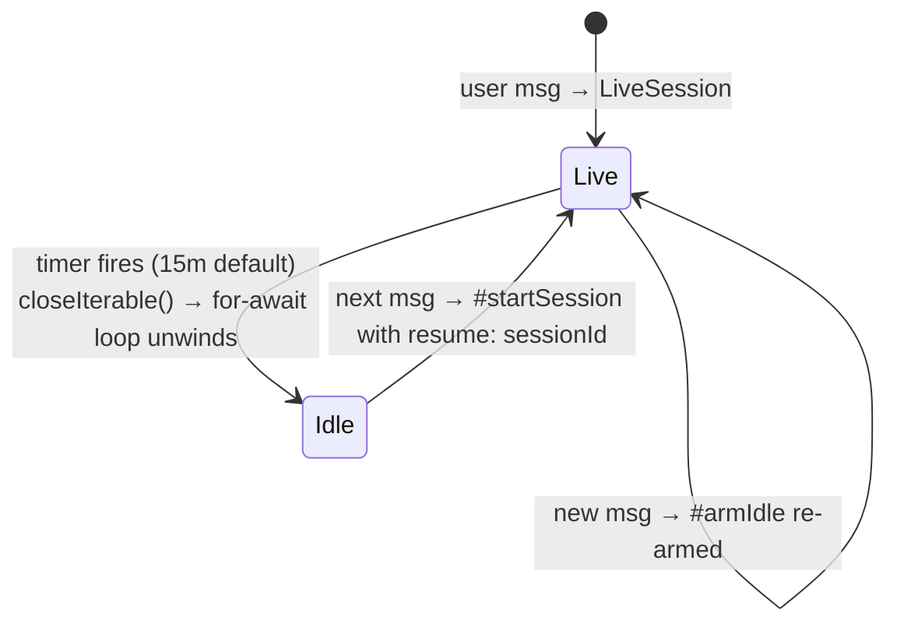
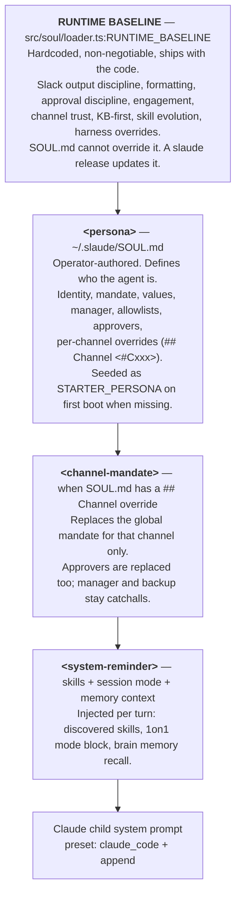
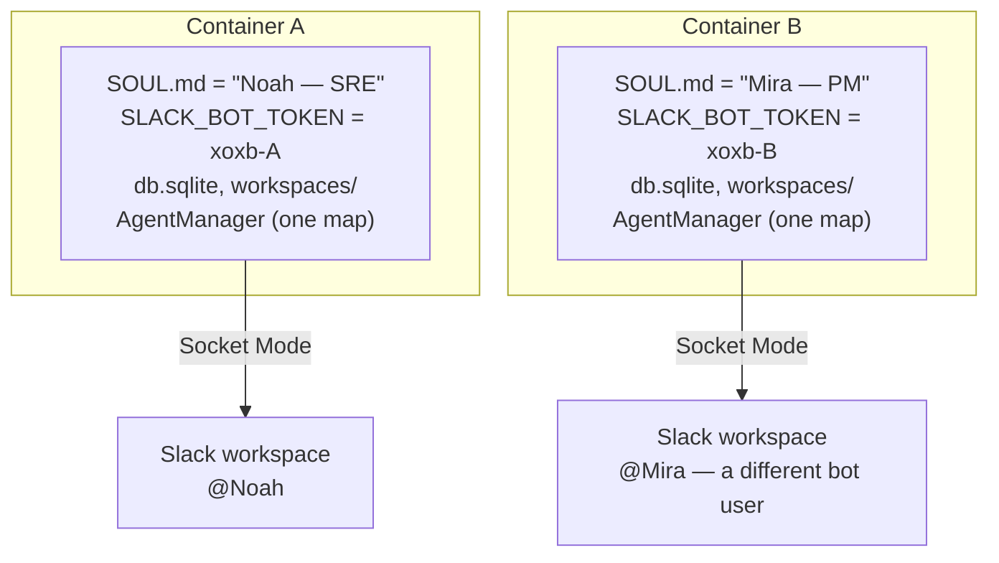

# Architecture

> One Slack thread = one persistent Claude session. One container = one persona.

Slaude is a headless Slack runtime for Claude Code. It binds Slack threads to durable agent sessions, wraps every side effect behind gateway-enforced gates, and keeps all state on a single PVC. This page explains how the pieces fit — in about 10 minutes.

---

## System diagram



### Layers at a glance

| Layer | Lives in | Responsibility |
|---|---|---|
| **Slack surface** | Slack workspace | Socket Mode events, threads, DMs, Block Kit buttons, reactions, presence |
| **Gateway** | `src/gateway/slack/*` | Trust boundary. Ingest, dedup, channel-mode, engagement, slash commands, MCP + OAuth wiring, stop guard |
| **AgentManager** | `src/agent/manager.ts` | `Map<sessionId, LiveSession>` over `@anthropic-ai/claude-agent-sdk`. Prompt iterable, resume, idle TTL, token budget, hooks |
| **Modules** | `src/{soul,skills,knowledge,memory,persona}` | Persona (two-layer prompt), skills, KB brain, episodic memory, persona registry |
| **Persistence** | `bun:sqlite` + `~/.slaude/` PVC | Per-thread sqlite rows + markdown on disk (SOUL.md, mcp.json, slaude.json/lock, wikis) |
| **Observability** | `src/health.ts`, `src/metrics.ts` | `/healthz`, `/readyz`, `/metrics` (Prometheus), per-channel + per-model labels |

> **Next.js parity check:** Next.js docs put the diagram first, then explain each layer top-to-bottom with a table. We do the same. If you only read the diagram and this table, you can navigate the codebase.

**Concepts you will see on every page**

| Term | Meaning |
|---|---|
| **Surface** | Platform-neutral `reply`/`edit`/`upload` contract (`src/gateway/core/surface.ts`). Slack adapter is one implementation; the sim drives the same surface over a fake transport. |
| **SoulData** | Typed JSON projection of `SOUL.md` (`src/soul/data.ts`). Gateway reads it; the model never decides policy. |
| **LiveSession** | One `SDK Query` loop in `AgentManager` (`Map<sessionId, LiveSession>`). Holds the prompt iterable, abort, idle timer, turn buffer. |
| **Engagement** | Per-thread boolean (`sessions.engaged`) — is this thread "talking to slaude" right now? Controls whether plain replies are handled. |

---

## Request lifecycle

### Inbound: Slack event → agent turn



**What the agent sees** per turn is a single wrapped envelope — not raw Slack JSON:

```xml
<channel source="slack" channel_id="C0123" thread_ts="1716000000.000100"
         inbound_ts="1716000001.000200" user_id="U0MANAGER" user_name="Barock"
         trust="trusted" one_on_one="false" locked_user="">
  the user's text
  <attachment name="screenshot.png" mimetype="image/png" size="48211"
              path="/home/slaude/.slaude/workspaces/C0123-1716000000.000100/screenshot.png" />
</channel>

Reply to the user by calling the mcp__slaude_surface__reply tool.
Plain assistant text is not delivered to Slack — only tool calls reach the user.
```

Trust, 1on1, attachments, and the reply discipline are all injected here — the model never has to infer them.

### Outbound: agent → Slack (MCP surface only)

Plain assistant text is **invisible**. The only path to Slack is the in-process MCP server `slaude_surface`:

| Tool | What it does |
|---|---|
| `reply` | Post a message in the bound thread (markdown → mrkdwn at post time) |
| `edit` | Edit a prior reply by `ref` |
| `upload` | Upload a file from the session `cwd` |
| `react` / `unreact` | Emoji reactions |
| `request_approval` | Block Kit Approve/Deny card — see [Trust boundary](#trust-boundary) |

The gateway also drives ambient UI outside the surface: `eyes` on receive, `gear` while working, `white_check_mark`/`x` on done/error, animated `thinking…` / `running <cmd>` status via Slack Agents API, and a live TodoWrite/TaskCreate tracker posted mid-turn.

---

## Trust boundary

> **Rule:** the LLM extracts policy, the gateway enforces it. Never the reverse.

### Extraction: SOUL.md → typed SoulData

At boot (and on every `sha256(SOUL.md)` change) an **ephemeral, tool-free Claude turn** projects the operator's free-form `SOUL.md` into a typed JSON validated by Zod:

```ts
// src/soul/data.ts — SoulDataSchema (abridged)
{
  identity:        { name?, role?, voice? },
  manager:        { userId?, handle? },
  backupManager:  { userId?, handle? },
  allowedChannels: string[],   // C/G/D ids — anyone may chat
  trustedChannels: string[],   // team channel — same gate, richer context hint
  blockedUsers:   string[],    // hard drop before Claude is invoked
  dmAllowedUsers: string[],    // DM allowlist beyond manager/backup
  approvers:      ApproverEntry[],  // { userId, scope, catchall }
  channelOverrides: ChannelOverride[], // per-channel mandate/approver replace
  mandate?:       string,
  values:         string[],
}
```

Caching: `~/.slaude/cache/soul.<sha>.json`. Any extraction failure falls back to a regex parser that only recovers `approvers` — the gateway never breaks open.

**Id grounding check** — every Slack id the extractor returns must appear verbatim in `SOUL.md` (`src/soul/extract.ts:assertIdsGroundedInPersona`). This blocks the LLM from inventing approvers or whitelisting channels the operator never authorized.

Runtime overlays (`/soul` slash command) apply on top via `soul_overrides` sqlite table and are read per-message — no restart needed. Overlay failures never take the gates down (fallback to `SOUL.md` base).

### Enforcement: gateway only

All five gates live in `src/gateway/slack/*` and run **before or around** the model — never inside it:

| Gate | File | What it enforces |
|---|---|---|
| **Blocked-user** | `adapter.ts` (handleMessage) | Drop before token spend. No logs leaked to the agent. |
| **Channel-mode** | `adapter.ts` (channel-mode gate) | `trusted`/`allowed` → anyone may chat. Unlisted + DM → manager/backup/`dmAllowedUsers` only. Approvers can still click Approve/Deny but cannot chat outside allowed channels. |
| **Engagement** | `adapter.ts` (engagement router) + `db/sessions.engaged` | `@mention` engages a thread, `@mention other` disengages, plain replies only handled when engaged. Persisted per-thread so disengage survives restarts. |
| **Approver authz** | `approval-gate.ts` + `soul/loader.ts:selectApproversFrom` | `request_approval` keyword-matches the agent's plan summary against each approver's scope tokens. Only matching approvers + catchalls get the Block Kit buttons. Per-channel overrides replace the global approver set but manager/backup are always retained as catchalls (no lockout). |
| **Per-tool permission** | `permission-gate.ts` (`canUseTool` callback) | SDK `canUseTool` → Block Kit Allow/Always/Deny per tool call. Respects `SLAUDE_AUTO_ALLOW_TOOLS` and per-thread `permission_mode` (`default`/`acceptEdits`/`bypassPermissions`/`plan`/`dontAsk`). |



> **What the LLM cannot do:** redirect an approval card to a different user, self-approve, bypass the `blockedUsers` hard-drop, or invent a channel allowlist entry. Those checks are pure code in `src/gateway/slack/*` and run on the gateway's `soulData()` — not on model output. A jailbroken persona can mislead an approver with a crafted summary, but it cannot change who gets the button.


---

## Session lifecycle

### One inbound message, end to end

Trace a single `@slaude fix the flake` through the system. Every box is a file you can open.



If any gate in step 2 drops the event, the model never runs and no token is spent. If step 4 finds no session row, one is created. If step 8 never calls `reply`/`edit`/`upload`, the `Stop` hook blocks and instructs the model to reply.

### One thread, one session, one cwd



- **Create:** first message in a thread → `Sessions.createForThread` allocates a UUID, `working_dir`, model, `permission_mode`, `persona_id`.
- **Bind:** `AgentManager.ensureSession` creates the row if absent; `handleMessage` builds a `Surface` binding (`conversationId`, `threadRef`, `inboundRef`, `userId`) and a `SlackContext` that every MCP tool closes over. Subsequent turns mutate the same context object so the SDK's mounted MCP servers stay valid without re-mounting.
- **Resume:** `sessionIdOpts(row)` — first boot seeds the Claude CLI with `extraArgs: { "session-id": row.id }` so both sides share one id. Later boots use `resume: row.id`. Resume-miss and id-collision are self-healed (clear `claude_started` or flip to resume and retry).

### Engagement: how a thread becomes "yours"

| Event | Effect |
|---|---|
| `app_mention` (`@slaude …`) | Engage thread (`engaged` Set + `sessions.engaged = 1`). Persisted. |
| `message` with `@slaude` | Same — engage + handle |
| `message` with `@other-user` (no `@slaude`) | Disengage (`engaged = 0`). If a session exists, the message is **recorded suppressed** (hook `continue:false` — persists to transcript, no model run) so re-engage resumes with the gap in history. If no session, drop. |
| Plain reply while engaged | Handle normally |
| Plain reply while disengaged + session exists | Record suppressed — no model run, no Slack feedback |
| Plain reply while disengaged + no session | Drop (never start a session for an unrelated thread) |
| `mention-only` mode on | Plain messages never trigger the model (even when engaged). Only `@mention` triggers a turn. Messages still recorded suppressed when a session exists. |
| `1on1` lock on | Only `locked_user` + manager/backup are heard. Others dropped before slash parsing so they cannot `/1on1 off` someone else's lock. |

Engagement is cached in-memory (`Set<string>`) **and** persisted on the session row. Without persistence, a disengage lasted zero messages — the next plain reply hit the restore path and re-engaged.

### Idle TTL and resume



- Configured by `SLAUDE_IDLE_MINUTES` (`env.idleMs()`). Default **15 minutes**. `0` disables.
- On expiry the SDK `Query` closes silently — no Slack message. The transcript is already persisted by the CLI.
- `TokenBudget` is forgotten on idle; `stopBlocked` cleared; `sessions` status → `idle`.
- Cron, `/mcp`, and OAuth flows can synthesize a session without an inbound message — they register a route synthetically so the next real user message resumes cleanly.

### Failure and recovery

| Failure | Detection | Recovery |
|---|---|---|
| **Resume miss** (`No conversation found with session ID`) — provider has no transcript for this id (cross-provider `ANTHROPIC_BASE_URL` swap, stale row) | `stderr` match + `result(is_error)` | Clear `claude_started`, reboot with `extraArgs: { session-id }` — silent, no Slack warning |
| **Session id already exists** — flag lost between CLI persist and `markStarted` | `stderr` match `session already in use` | Flip to `resume: sessionId` and retry |
| **MCP stream closed** — external MCP disconnect tears down the shared transport pool, all `slaude_*` tools fail with `Stream closed` | `tool_use_result` string match `stream closed` | Auto-reload at turn end (`reload` + synthetic `continue`); circuit breaker after 2 consecutive reloads — surfaces error instead |
| **Token budget critical** (≥ 92% of context window) | `TokenBudget.evaluateThreshold` (edge-triggered, one-shot per session) | Transport can surface a warning / trigger cooperative resume; `fallback 200k` when `modelUsage` absent |
| **Extraction failure** | Any throw in `loadSoulData` | Regex fallback (approvers only), gateway gates stay on safe base |

All recovery is **silent to the user** except the circuit-open case — Next.js-style, the happy path never mentions errors; a dedicated section does.

### Hooks that shape every turn

| Hook | When | What it does |
|---|---|---|
| `UserPromptSubmit` (disengage) | Every turn, before the model | `disengagedHookDecision` returns `continue:false` when `sessions.engaged = 0` — message persists, model halted |
| `UserPromptSubmit` (notes) | Next engaged turn | Drains `#sessionNotes` (mcp connect/disconnect, `/model`/`/mode`/`/soul`/`/cron` events) into `additionalContext` once |
| `UserPromptSubmit` (mention-only) | Every turn | `suppressNextTurn` check — `continue:false` for plain messages in mention-only threads |
| `PreCompact` | SDK context compaction | Emits `compacting` event → status indicator. `manual` trigger remembered to show `wasCompacting` |
| `Stop` | Turn wants to stop | `setStopGuard` blocks once if `!route.spoke && !route.silent` with instruction to call `reply` — forces at least one user-visible Slack tool per turn |

---

## Persistence

Two tiers. Both live under `~/.slaude/` (or `$SLAUDE_HOME`), typically a Kubernetes `PersistentVolume`.

### Tier 1 — SQLite (per-thread state)

`bun:sqlite` WAL mode, single file at `~/.slaude/db.sqlite` (overridable via `SLAUDE_DB_PATH`).

| Table | Key | What it stores |
|---|---|---|
| `sessions` | `(team, channel, thread_ts, persona_id)` unique | UUID, `claude_started`, `status`, `model`, `working_dir`, `permission_mode`, `engaged`, `persona_id` |
| `one_on_one_locks` | `(channel, thread_ts)` | `locked_user`, `open_scope` (null = locked, string = open to guests) |
| `mention_only_threads` | `(channel, thread_ts)` | `created_by` — receive-time routing flag, no session reboot needed |
| `ignores` | `id` + partial indexes on user/thread | `target_type`, `expires_at`, `reason` — 5-min sweeper cleans expired |
| `cron_jobs` | `id` + `next_run_at` index | `channel_id`, `thread_ts`, `target` (thread vs channel root), `when_active` (fire vs skip), `paused`, `persona_id`, `oauth_user` |
| `soul_overrides` | `(field, value)` | Runtime ACL overlay (`trustedChannels`/`allowedChannels`/`dmAllowedUsers`/`blockedUsers`) |
| `kb_ingest_jobs` | `id` + partial unique on `running` | One ingest at a time (mutex) |

Migrations are inline in `src/db/schema.ts` — checked via `PRAGMA table_info` and applied transactionally (sessions rebuild wraps the rename-copy-drop in a transaction).

### Tier 2 — PVC markdown + caches (`~/.slaude/`)

```
~/.slaude/
├── SOUL.md                         # operator-authored persona (seeded if missing)
├── mcp.json                        # external MCP servers (stdio/http/sse)
├── slaude.json                     # dependency manifest (plugins, skills, KBs)
├── slaude.lock                     # pinned shas
├── .env                            # provider + Slack tokens (loaded via loadDotenv)
├── db.sqlite                       # ← Tier 1
├── cache/
│   └── soul.<sha>.json             # SoulData extraction cache, keyed by sha256(SOUL.md)
├── skills/<slug>/SKILL.md          # installed skills (also mounted as a local CC plugin)
├── knowledge/<label>/{raw,wiki}/   # installed KB wikis
├── workspaces/<team>-<channel>-<thread>[__persona]/  # per-session cwd (git worktree root)
├── personas/<name>/{config.json, SOUL.md}  # multi-persona mode (each has its own Slack user)
├── .claude/plugins/cache/          # CC marketplace plugins (slaude install --frozen)
└── .claude/projects/               # per-session transcript shards (CLI-owned, via CLAUDE_CONFIG_DIR)
```

| Artifact | Source of truth | How it gets there |
|---|---|---|
| `SOUL.md` | Operator edits or `seed STARTER_PERSONA` | Manual; re-extracted on change |
| `mcp.json` | Operator | Manual; loaded by `loadExternalMcp`, merged into `mcpServers` per session |
| `slaude.json` / `slaude.lock` | `bun run install-deps` | Declares `plugins`/`skills`/`knowledge` git sources; `--frozen` for Docker/CI |
| `skills/*/SKILL.md` | Git repos + runtime `write_skill` | Hot-reloaded via `discoverSkills` each turn; synced back via `sync_manifest` |
| `knowledge/*/wiki/*` | Git repos + `brain` indexing | Indexed into brain at boot + nightly maintenance (03:00) |
| `workspaces/*` | Session creation | Per-thread cwd; files attached in Slack land here |

Health probes hit `GET /healthz` (liveness) and `GET /readyz` (sqlite `SELECT 1` ping) on `SLAUDE_HEALTH_PORT` (default `8080`) — wired as K8s `livenessProbe`/`readinessProbe` in `deploy/k8s/slaude.yaml`.

---

## Two-layer persona

The system prompt is a composition — not a single file.



| Layer | Where | Can the operator change it? | Can the model ignore it? |
|---|---|---|---|
| Runtime baseline | `src/soul/loader.ts` | No — code change + release | No — outside `<persona>`, prompt says non-negotiable |
| `SOUL.md` persona | `~/.slaude/SOUL.md` | Yes — edit file, re-extracted on next sha change | Persona can drift, but gates still enforce allowlists |
| Channel override | `## Channel` block in `SOUL.md` | Yes | Replaces mandate/approvers for that channel |
| Runtime overlay | `soul_overrides` sqlite | Yes — `/soul add/remove` (manager-only) | Effective immediately, all sessions |

> **Why two layers?** The baseline lets the project tighten guardrails (output discipline, approval rules, KB-first) in a release without touching any operator's persona. The persona stays focused on identity and mandate — not mechanical rules.

---

## Headless and multi-agent

### One container = one persona

`src/server.ts` boots one `AgentManager` + one Slack transport (Socket Mode) + one health server. There is no `/personality` switch inside a running container. The `SOUL.md` at `~/.slaude/SOUL.md` is that container's identity.



Scale to N agents by deploying N containers — each with its own PVC (or subPath), its own Slack app/bot token, and its own `SOUL.md`. No shared state between them.

### Multi-persona inside one container (opt-in)

When `~/.slaude/personas/<name>/` exists, slaude enters **multi-persona mode** (`src/persona/registry.ts`):

- Each persona has `config.json` (`{ slackUserId, name, userToken? }`) + `SOUL.md`.
- Sessions are keyed by `(team, channel, thread_ts, persona_id)` — named personas sharing a thread get isolated rows, isolated `workspaces/<thread>__<persona>` dirs, isolated `CLAUDE_CONFIG_DIR` transcripts, and isolated brain slices (`SLAUDE_AGENT_ID = persona.slackUserId`).
- Mention routing: `@Noah` / `@Mira` is resolved via `registry.lookupByUserId` — the mentioned persona handles the turn. The default bot `@slaude` still works as before.
- Posting identity: a persona with `userToken` (xoxp) posts as its own Slack user via `outClient`; without it, posts as the bot.
- The global `SOUL.md` + single `db.sqlite` remain — default-persona sessions are unchanged.

> Multi-persona is a single-process convenience for small teams. For hard isolation (separate PVCs, deploys, rate limits), prefer multi-deploy.

---

## External integrations

### External MCP servers (`mcp.json`)

Declared in `~/.slaude/mcp.json` (same shape as Claude Code's `mcp.json`). Three transports: `stdio`, `http` (streamable), `sse`.

- Tools surface as `mcp__<server>__<tool>` and route through the same `canUseTool` gate as in-process MCPs — first call per server posts a Block Kit Approve/Deny (approval gate).
- `${VAR}` substitution in `args`/`env`/`url`.
- `/mcp` slash command supports OAuth flows for `http` servers: loopback listener (ephemeral or shared `SLAUDE_OAUTH_SHARED_LOOPBACK` on `:3118`) or paste-back (`SLAUDE_OAUTH_REDIRECT_URL` for k8s). Scope is `initiator` (per-user isolated `CLAUDE_CONFIG_DIR`) vs `global` (manager wires the agent's shared identity).
- `/1on1` private services: servers listed in `privateServices` mount with stubbed credentials outside a 1on1, real credentials only inside the initiator's lock.

### Claude Code plugins (`slaude.json`)

Marketplace git → pinned sha via `slaude install`. Mounted as SDK `plugins: [{ type: "local", path, skipMcpDiscovery }]`. The SDK's `--plugin-dir` path does not auto-mount a plugin's `.mcp.json` — slaude merges `loadInstalledPluginMcps()` into `mcpServers` explicitly. `slaude install --frozen` is the CI/Docker path (lockfile must match).

`~/.slaude/` itself is always mounted as a local plugin so `~/.slaude/skills/<slug>/SKILL.md` is discovered each turn without a manifest entry.

---

## Observability

| Signal | Where | Labels |
|---|---|---|
| Prometheus metrics | `GET /metrics` (text) | `channel_id`, `model`, `kind` (input/output/cache_read/cache_creation), `tool`, `result` |
| Token budget | `TokenBudget` per session | Warn `0.80`, critical `0.92` (one-shot per session), fallback `200k` (override `SLAUDE_FALLBACK_CONTEXT_WINDOW`) |
| Health | `GET /healthz` / `GET /readyz` | `readyz` pings sqlite |
| Logs | stdout | `[slack-rx]`, `[slack-auth]`, `[mgr]`, `[soul]`, `[brain]`, `[mcp]` prefixes; `stderr` carries `[claude-cli]` child logs |
| Static labels | `SLAUDE_METRICS_LABELS` | Applied to every metric, e.g. `agent=noah,env=prod` |

---

## Further reading

- [SOUL and approvals](../guides/engagement.md) — authoring SOUL.md, approver scopes, channel overrides, `/soul` overlays
- [Engagement and sessions](../guides/engagement.md) — threading, 1on1, mention-only, slash commands
- [Skills and KB](../reference/api.md) — skill lifecycle, brain memoize, KB sync
- [Deployment](../deploy/index.md) — Docker, K8s PVC, env reference, health probes
- [Gateway findings](https://github.com/barockok/slaude/tree/main/docs/site/_content/field-notes) — design rationale and incident notes behind each gate

---

*Diagram source: [`docs/architecture.html`](https://github.com/barockok/slaude/blob/main/docs/internal/architecture.html). Gateway enforcement: [`src/gateway/slack/adapter.ts`](https://github.com/barockok/slaude/blob/main/src/gateway/slack/adapter.ts). Session lifecycle: [`src/agent/manager.ts`](https://github.com/barockok/slaude/blob/main/src/agent/manager.ts). Soul extraction: [`src/soul/extract.ts`](https://github.com/barockok/slaude/blob/main/src/soul/extract.ts). Persistence: [`src/db/schema.ts`](https://github.com/barockok/slaude/blob/main/src/db/schema.ts). Persona: [`src/soul/loader.ts`](https://github.com/barockok/slaude/blob/main/src/soul/loader.ts) + [`src/persona/registry.ts`](https://github.com/barockok/slaude/blob/main/src/persona/registry.ts). Headless entry: [`src/server.ts`](https://github.com/barockok/slaude/blob/main/src/server.ts).*
